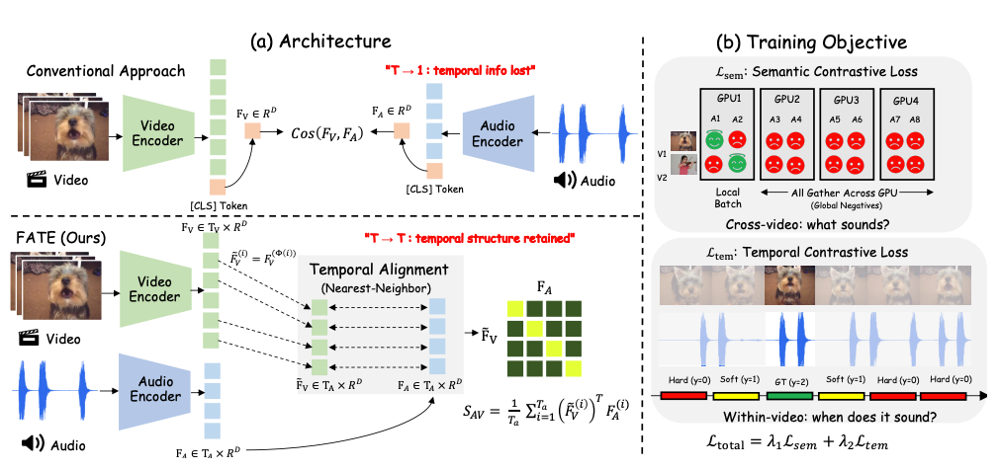

# FATE: Frame-Level Audio-Visual Temporal Embedding

Official implementation of Paper: [FATE: Frame-Level Audio-Visual Temporal Embedding](https://arxiv.org/abs/2608.01310)



## Setup

### 1. Download Checkpoints

Download the public base model:

```bash
hf download facebook/pe-av-small \
  --local-dir weights/pe-av-small
```

```bash
hf download Guan123/fate \
  --local-dir weights/fate
```

### 2. **Environment Setup**

```bash
conda create -n fate python=3.10 -y
conda activate fate
pip install -r requirements.txt
```

### 3. **Data layout**

Put the dataset videos directly under the evaluation directory (nested directories are also accepted):

```text
data/
  avsync15/
    *.mp4
  vggsound/
    *.mp4
  vgg-sync/
    *.mp4
```


## Quick start

Then run AVSync-15 retrieval:

```bash
MODEL_PATH=./weights/pe-av-small \
FATE_CHECKPOINT=./weights/fate \
DATA_DIR=./data/avsync15 \
bash scripts/eval_example.sh
```

The base model may also be downloaded automatically:

```bash
python -m eval.eval_mixed_retrieval \
  --model_path facebook/pe-av-small \
  --lora_path ./weights/fate-lora \
  --test_dir ./data/avsync15 \
  --dataset avsync \
  --num_distractors 50 \
  --ks 1 3
```

The command prints:

- **Intra-video retrieval:** candidates are temporal segments from the same video.
- **Inter-video retrieval:** candidates additionally contain segments from 50 distractor videos.
- **V2A / A2V:** video-to-audio and audio-to-video retrieval.
- **R@k / N@k:** Recall@k and NDCG@k.

All random choices use a fixed seed (`42` by default).

To verify installation and checkpoint loading on one video:

```bash
python -m eval.eval_mixed_retrieval \
  --model_path ./weights/pe-av-small \
  --lora_path ./weights/fate-lora \
  --test_dir ./data/avsync15 \
  --num_distractors 0 \
  --ks 1 3 \
  --max_videos 1 \
  --max_segments 3
```


## Repository layout

```text
fate/
  models/pe_av/                 # PE-AV backbone with frame-level outputs
  eval/eval_mixed_retrieval.py  # main retrieval evaluator
  scripts/eval_example.sh       # one-command evaluation
  datasets.py                   # deterministic temporal segmentation
  requirements.txt
```

Training and auxiliary evaluation code is retained for reference, but the supported release path is the final adapter plus `eval/eval_mixed_retrieval.py`

## Train

```
bash scripts/train_example.sh
```


## Citation

```bibtex
@article{guan2026fate,
  title={FATE: Frame-Level Audio-Visual Temporal Embedding},
  author={Guan, Kaisi and Zhang, Bingzi and Wang, Xihua and Ba, Ying and Cheng, Xin and Chen, Yijing and Song, Ruihua},
  journal={arXiv preprint arXiv:2608.01310},
  year={2026}
}
```

